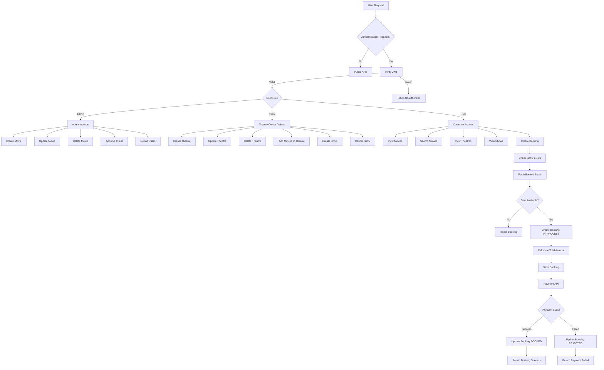

# 🎬 Movie Booking Backend

A production-style Movie Booking Backend built using **Node.js, Express, and MongoDB** with role-based access for **Admin, Theatre Owners, and Users**.  
The system supports movie & theatre management, show scheduling, seat availability validation, booking workflow, and simulated payment processing.

---

# 🚀 Features

## 🔐 Authentication & Roles
- JWT based authentication
- Role-based access (Admin, Theatre Owner, User)
- Protected routes using middleware

---

## 🎬 Movie Management
- Create movie
- Update movie
- Get movie by ID
- Search movie by name
- Get all movies

---

## 🎭 Theatre Management
- Create theatre
- Update theatre
- Get theatre by ID
- Search theatre by city
- Search theatre by pincode
- Get all theatres

---

## ⏰ Show Management
- Create show
- Update show
- Delete show
- Get shows by theatre
- Get shows by movie
- Get all shows

---

## 🎟️ Booking System
- Seat availability validation
- Prevent duplicate seat booking
- Booking status workflow
- Get bookings by user
- Populate movie, theatre and show details

---

## 💳 Payment (Fake Integration)
- Simulated payment API
- Payment success flow
- Payment failed flow
- Booking status update after payment

```
IN_PROCESS → BOOKED → REJECTED
```

---

# 🏗️ Tech Stack

- Node.js
- Express.js
- MongoDB
- Mongoose
- JWT Authentication
- REST API
- Middleware Architecture

---

# 📁 Project Structure

```
backend/
│
├── config/
├── controllers/
├── middleware/
├── models/
├── routes/
├── services/
│
├── index.js
├── package.json
└── .env
```

---

# 🔄 Booking Flow

```
User selects show
        ↓
Check seat availability
        ↓
Create booking (IN_PROCESS)
        ↓
Fake payment API
        ↓
Payment Success → BOOKED
Payment Failed  → REJECTED
```

---

# 📌 API Endpoints

---

# 🔐 Authentication & Users

### Authentication
```
POST   /mba/api/v1/signup
POST   /mba/api/v1/login
POST   /mba/api/v1/logout
PATCH  /mba/api/v1/reset
```

### User Management
```
GET    /mba/api/v1/all-users
PATCH  /mba/api/v1/update-user-info/:id
```

### Client (Theatre Owner) Requests
```
POST   /mba/api/v1/user/request-client
PUT    /mba/api/v1/user/approve-client
```

---

# 🎬 Movies APIs

```
POST   /mba/api/v1/movies
GET    /mba/api/v1/all-movies
GET    /mba/api/v1/movies/search
GET    /mba/api/v1/movies/:movieid
PUT    /mba/api/v1/movies/:movieid
PATCH  /mba/api/v1/movies/:movieid
DELETE /mba/api/v1/movies/:movieid
```

---

# 🎭 Theatre APIs

```
POST   /mba/api/v1/theatre
GET    /mba/api/v1/theatre/search
GET    /mba/api/v1/theatre/movie
GET    /mba/api/v1/all-theatre
GET    /mba/api/v1/theatre
PATCH  /mba/api/v1/theatres/:id/movies
PUT    /mba/api/v1/theatre/:id
DELETE /mba/api/v1/theatre/:id
```

---

# ⏰ Show APIs

```
POST   /mba/api/v1/create-show
GET    /mba/api/v1/theatre/:id
DELETE /mba/api/v1/delete-show/:id
```

---

# 🎟️ Booking APIs

```
POST   /mba/api/v1/create-show-booking
GET    /mba/api/v1/user/all-booking/:id
DELETE /mba/api/v1/user/booking/delete-booking/:id
```

---

# 💳 Payment API

```
POST   /mba/api/v1/payment
```

---

# 🔄 Booking Workflow

```
Create Booking
      ↓
Seat Availability Check
      ↓
Booking Status → IN_PROCESS
      ↓
Payment API
      ↓
SUCCESS → BOOKED
FAILED  → REJECTED
```

---

# 👥 Roles

```
ADMIN
CLIENT (THEATRE OWNER)
USER (CUSTOMER)
```
# 🔄 Movie Booking System Flowchart


---
# 📬 Future Improvements

- Redis caching
- AI movie recommendation
- Real payment gateway (Stripe/Razorpay)
- Seat locking with timeout
- Notification system

---

# 👨‍💻 Author

Movie Booking Backend built for learning and demonstrating backend architecture using Node.js.
